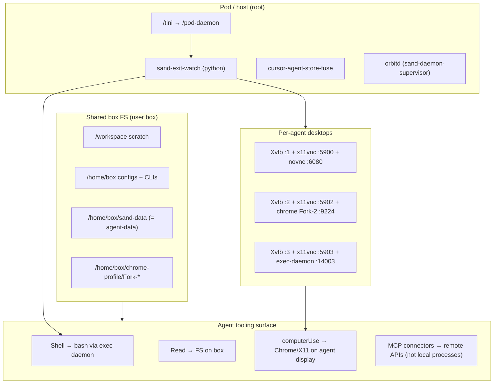

# ARCHITECTURE — Shared Grok Bot Box

**Evidence timestamp:** 2026-10-05 16:51 CEST (Europe/Paris UTC+2; box /etc/timezone=Europe/Madrid, same offset)  
**Sources:** `uname -a`, `ps`, `ss -lntp`, filesystem listing under `/home/box`, `/workspace`, `/opt`, `/usr/local/bin`, `$DISPLAY`, `/home/box/.sand-window-assignments.json`, `/home/box/sand-data/agents/*/profile.json`.

## Summary

This machine is a **shared Linux box** (`grok-bot-vm-3707809`, Debian-based, kernel `6.12.94+`). Multiple agents share one filesystem; each agent gets a **separate X11 desktop** (Xvfb display) and often its own Chrome profile fork. Agent tooling (Shell/Read/MCP/computerUse) is mediated by **exec-daemon** Node processes and **sand-*** supervisors — not by inventing a separate VM per agent.

## Layers (observed)

## Filesystem layout (live)

| Path | Role | Source |
|------|------|--------|
| `/workspace` | Shared scratch (daintree repo, telemetry, secrets dir, sota-suite, downloads) | `ls /workspace` |
| `/workspace/grokbot-telemetry/` | This documentation system | created this session |
| `/workspace/secrets/` | Credential export present — **contents REDACTED / not read** | `ls -la` only |
| `/home/box` | User home: CLI configs (`.claude`, `.codex`, `.grok`, `.opencode`, `.daintree`, `.gemini`, `.cursor`, `.bun`, `.nvm`, `.local`) | `ls -la /home/box` |
| `/home/box/agent-data` → `/home/box/sand-data` | Symlink to agent state store | `readlink` |
| `/home/box/sand-data/agents/<uuid>/` | Per-agent assets/attachments/profile/store.db | `find` |
| `/home/box/chrome-profile/` | Chrome user-data dirs per fork | chrome cmdline `--user-data-dir=.../Fork-2` |
| `/home/box/cli-config/` | mode `700` — treat as credential store; **not read** | `stat` |
| `/usr/local/bin/sand-*`, `box-*` | Box supervisor / desktop wrappers | `ls /usr/local/bin` |
| `/opt/sand/sand-host/` | Host main + extensions (e.g. codebase-telemetry) | `ls /opt/sand` |
| `/opt/Daintree/` | Electron app binary `daintree` | `ls /opt/Daintree` |
| `/exec-daemon/` | Node exec-daemon binary tree (not fully listed; seen in cmdline) | `ps` |

## Agents observed (profiles)

**Updated:** 2026-10-05 17:05 CEST from `profile.json` + window assignments + Collector 1.

| Agent UUID | Name | Desktop |
|------------|------|---------|
| `11eafd10-3717-42e6-99a7-29c889b5c4a0` | Grok Bot | UNKNOWN |
| `501f1c5c-7414-4335-ae6d-7bb39171f819` | Android Setup And config | UNKNOWN |
| `59b161ea-9ed8-45e9-9343-d88856e1b37b` | VOMEGA-MASTER | **:2** / exec 14002 |
| `c873572d-0782-43e9-8773-459eae590ee7` | TELEMETRY-MASTER | **:3** / exec 14003 |
| `da3f13c0-b787-4f33-b771-3c3118b03c5e` | AUTH-MASTER | **:4** / exec 14004 |
| `8070f3a8-4839-482f-a21f-5a27e0c37574` | Daintree Master | **:5** / exec 14005 |
| `b89d2383-420a-4aff-bc12-76f86fd69c58` | Research Master | **:6** / exec 14006 |
| `134a7c4b-e4d1-44f2-8a56-bf86910c7276` | Runtime Master | UNKNOWN |
| `2b5105b7-b669-47fe-9454-651542a04d57` | Code Master | UNKNOWN |
| `2006f479-a72e-4369-b8bf-573babfab04c` | MIRROR-MASTER | **:7** / exec 14007 |

Window-assignment **tokens** redacted. Xvfb `:1`–`:7` observed (assignments through :7).

Source: `/home/box/sand-data/agents/*/profile.json`, `/home/box/.sand-window-assignments.json`, `DATA/exec_daemon_latest.jsonl`.

## Desktop stack (per display)

Observed pattern for `:1`, `:2`, `:3`:

1. `start-desktop.sh` → `Xvfb :<n> -screen 0 1920x1200x24 ...`
2. `x11vnc -display :<n> -rfbport 5900|5902|5903 -localhost ...`
3. For `:1`: `websockify` novnc on `0.0.0.0:6080` → `localhost:5900`
4. `xfwm4`, `picom`, `plank` window manager / compositor / dock
5. Optional: `google-chrome` / `box-chrome` with `--user-data-dir=/home/box/chrome-profile/Fork-<n>`, CDP on `9224`/`9225`, proxy via `sand-egress-tunnel` `127.0.0.1:8791`

| Display | Xvfb PID (approx) | x11vnc port | exec-daemon ports | Chrome CDP |
|---------|-------------------|-------------|-------------------|------------|
| `:1` | 562 | 5900 | 1337 / pty 1338 (base) | UNKNOWN at snapshot |
| `:2` | 17214 | 5902 | 14002 / pty 13602 | 9224 (Fork-2, pid 28187) |
| `:3` | 71765 | 5903 | 14003 / pty 13603 | 9225 seen (pid 77071) |

Sources: `ps`, `ss -lntp`, `/tmp/.X{1,2,3}-lock`.

## Exec / Shell mechanism

| Agent concept | Concrete mechanism (observed) |
|---------------|-------------------------------|
| **Shell** | bash spawned under exec-daemon Node (`/exec-daemon/node /exec-daemon/index.js serve --port ... --computer-use-enabled ...`). Per-agent Shell is a bash sandbox-wrapper child of exec-daemon on port **1400N** (TELEMETRY: **14003** / pid **73037**). Base **1337** hosts sand-playwright-runtime (computerUse CDP). See PROCESS_MAP + Collector 1. |
| **Read** | Direct filesystem read on shared box (tool-side); no separate local daemon required beyond FS. |
| **computerUse** | Flag `--computer-use-enabled` on exec-daemon; drives X11/Chrome on the agent’s display. Exact UI automation binary path: **UNKNOWN** (not isolated in this baseline beyond chrome + Xvfb). |
| **Task / subagents** | **UNKNOWN** at process level this turn (no distinct “Task” binary observed). Sibling agents leave parallel Shell/bash under their own exec-daemon ports. |
| **SendToUser** | **UNKNOWN** on-box (no local process named SendToUser). Likely host/chat channel, not a box CLI. |
| **MCP connectors** | Listed in agent dynamic catalog (Gmail, Drive, GitHub, Vercel, cursor-github, cursor-origin). Local side effects: typically none beyond network; auth lives off-box / connector runtime. **No MCP server PIDs attributed in this baseline.** |
| **Auth handoffs** | Browser/OAuth flows: evidence of `codex auth`, `opencode auth login` processes running during baseline; Chrome on Fork-2. |

## Networking (selected listeners)

| Port | Process | Role |
|------|---------|------|
| 1337 / 1338 | exec-daemon pid 362 | Base serve + PTY |
| 1339 | sand-window-router pid 217 | Window router |
| 14002 / 13602 | exec-daemon pid 17990 | Agent desktop :2 |
| 14003 / 13603 | exec-daemon pid 73037 | Agent desktop :3 (this agent) |
| 8790 / 8791 | sand-egress-tunnel | Egress proxy (Chrome uses 8791) |
| 6080 / 6081 | websockify/novnc | Remote desktop web |
| 5900/5902/5903 | x11vnc | VNC per display |
| 9224 / 9225 | chrome | CDP |

## Timezone note

- User zone: Europe/Paris (UTC+2 / CEST).  
- Box `/etc/timezone`: **Europe/Madrid** (also CEST / UTC+2).  
- `date` reports **CEST**. Times in this docs set use CEST and are equivalent to Paris local for this date.

## UNKNOWN (explicit)

- Exact mapping of parent chat “Shell tool call” → child PID lineage beyond exec-daemon (needs auditd/ebpf or exec-daemon logs).
- Full computerUse control plane binary / protocol.
- Whether MCP tools run in-process on host vs remote only.
- Contents of box-secrets / gateway / host-secrets (intentionally unread).
- Persistence of `/tmp/sand-box-telemetry.log` schema (file exists, 52KB; not parsed yet).

## Chrome / CDP mapping (Collector 3 evidence)

| Rule | Evidence |
|------|----------|
| Profile path | `/home/box/chrome-profile/Fork-N` |
| DISPLAY | `:N` (from chrome launcher env / Fork number) |
| CDP port | `9222 + N` (e.g. :2→9224, :3→9225, :4→9226, :5→9227) |
| computerUse | `sand-playwright-runtime` under exec-daemon **1337** attaches to agent CDP URLs |
| Log | `/tmp/sand-box-telemetry.log` JSONL kinds: memory_sample, chrome_profile_sample, chrome_launch, … |

Source: `DATA/cdp_display_map_latest.json`, live `ps`/`ss`, 2026-10-05 17:07 CEST.

## Daintree Master operational notes (peer + spot-check)

| Topic | Detail | Evidence tag |
|-------|--------|--------------|
| Agent / display | Daintree Master → Xvfb **:5** / CDP **9227** / Fork-5 | assignments + CDP map + live `DISPLAY=:5` on daintree pid |
| Version | 0.41.0 (Electron 42.x) | crashpad; do **not** use `daintree --version` in collectors |
| Launch | Prefer `DISPLAY=:5 setsid bash -lc 'daintree'` to avoid orphan on wrong display | PEER recipe |
| Playground | `/workspace/daintree-playground` | git `88f6959` CONFIRMED |
| Worktrees | under `/workspace/daintree-playground-worktrees/` | feature-alpha-note `a74c7ff`, chore-beta-note `88f6959` CONFIRMED |
| Human docs | `/workspace/daintree-docs/` | CONFIRMED present |

