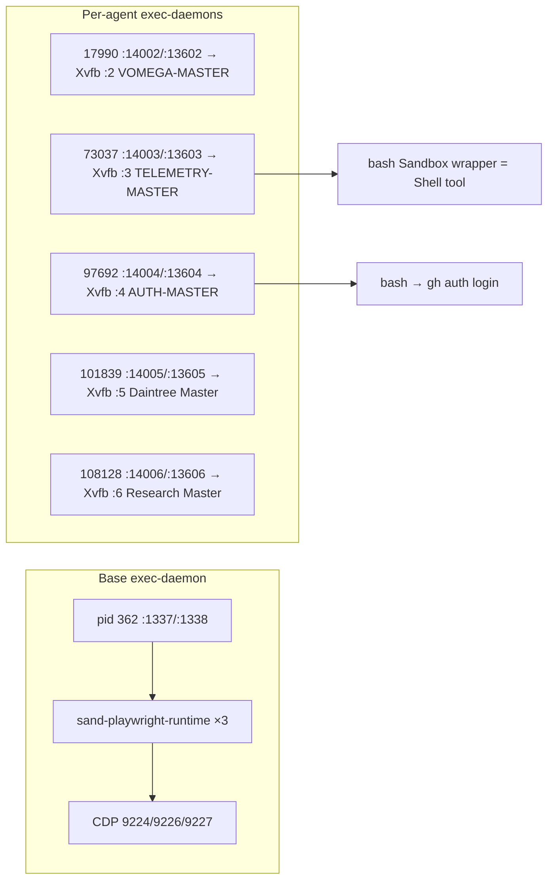
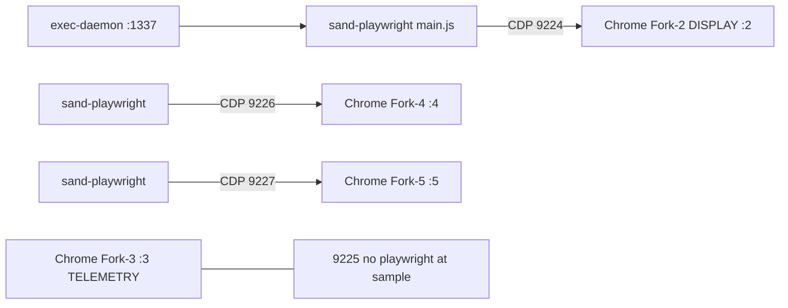

# PROCESS_MAP

**Updated:** 2026-10-05 ~17:05 CEST (Collector 1)  
**Sources:** `collectors/exec_daemon_sample.sh` → `DATA/exec_daemon_latest.jsonl`, `ps`, `ss -lntp`, `.sand-window-assignments.json` (assignments only; tokens redacted), Xvfb `pgrep`.

## Exec-daemon ↔ display ↔ agent



| PID | Serve port | PTY port | Display | Agent name | Agent UUID (prefix) | Notes |
|-----|------------|----------|---------|------------|---------------------|-------|
| 362 | 1337 | 1338 | `:1` (convention) | — | — | Started via `start-exec-daemon`; hosts playwright workers |
| 17990 | 14002 | 13602 | `:2` | VOMEGA-MASTER | `59b161ea…` | Often 0 Shell children |
| 73037 | 14003 | 13603 | `:3` | TELEMETRY-MASTER | `c873572d…` | This collector's Shell parent |
| 97692 | 14004 | 13604 | `:4` | AUTH-MASTER | `da3f13c0…` | Observed `gh auth login --web` |
| 101839 | 14005 | 13605 | `:5` | Daintree Master | `8070f3a8…` | Idle at sample |
| 108128 | 14006 | 13606 | `:6` | Research Master | `b89d2383…` | Idle at sample |
| 153667 | 14007 | 13607 | `:7` | MIRROR-MASTER | `2006f479…` | Appeared ~17:05 CEST |

**Formula:** agent desktop `N` → serve `1400N`, pty `1360N`, Xvfb `:N`, x11vnc `5900+(N==1?0:N)` (empirical: :1→5900, :2→5902, :3→5903, …).

## Shell tool signature (observed)

```
/usr/bin/bash -O extglob -c 'snap=$(command cat <&3) && … eval "$1"; … dump_bash_state >&4; …'
```

- **PPID:** agent exec-daemon (1400x) or occasionally base 1337 for some host reads.
- **cwd:** typically `/workspace`.
- **Lifetime:** seconds to minutes; idle agents show empty child lists.

## computerUse / Playwright (base daemon)

Under pid **362**:

| Depth | Pattern |
|------:|---------|
| 1 | `node …/sand-playwright-runtime/dist/main.js --cdp-endpoint http://127.0.0.1:922X …` |
| 2–3 | `bwrap --unshare-all …` sandbox |
| 4 | `/exec-daemon/node …/worker.js` |

CDP ports seen: **9224, 9226, 9227** (Chrome forks on agent displays use matching remote-debugging ports).

## Xvfb displays (live)

| Display | Example Xvfb PID (sample) |
|---------|---------------------------|
| `:1` | 562 |
| `:2` | 17214 |
| `:3` | 71765 |
| `:4` | 95767 |
| `:5` | 99636 |
| `:6` | 105714 |

## Agents without display assignment (snapshot)

| UUID prefix | Name |
|-------------|------|
| `11eafd10…` | Grok Bot |
| `501f1c5c…` | Android Setup And config |
| `134a7c4b…` | Runtime Master |
| `2b5105b7…` | Code Master |

## Supervision (unchanged core)

`tini` → `pod-daemon` → `sand-exit-watch` (pid 53) still parents most long-lived services including per-window `start-desktop.sh` and many exec-daemons (PPID 53). Base exec-daemon uniquely under `supervise-exec-daemon` → `start-exec-daemon`.


## CDP ↔ chrome-profile ↔ display (Collector 3)

**Updated:** 2026-10-05 17:07 CEST — `DATA/cdp_display_map_latest.md`

**Formula (observed):** `remote-debugging-port = 9222 + N` where N is display number and `chrome-profile/Fork-N`.



| CDP | Display | Fork | Agent | Playwright main PID |
|-----|---------|------|-------|---------------------|
| 9224 | :2 | Fork-2 | VOMEGA-MASTER | 82851 |
| 9225 | :3 | Fork-3 | TELEMETRY-MASTER | — |
| 9226 | :4 | Fork-4 | AUTH-MASTER | 123176 |
| 9227 | :5 | Fork-5 | Daintree Master | 104112 |

Refresh: `collectors/sandbox_telemetry_parse.sh`

## How to refresh

```bash
/workspace/grokbot-telemetry/collectors/exec_daemon_sample.sh
# → DATA/exec_daemon_latest.jsonl + .md
```
